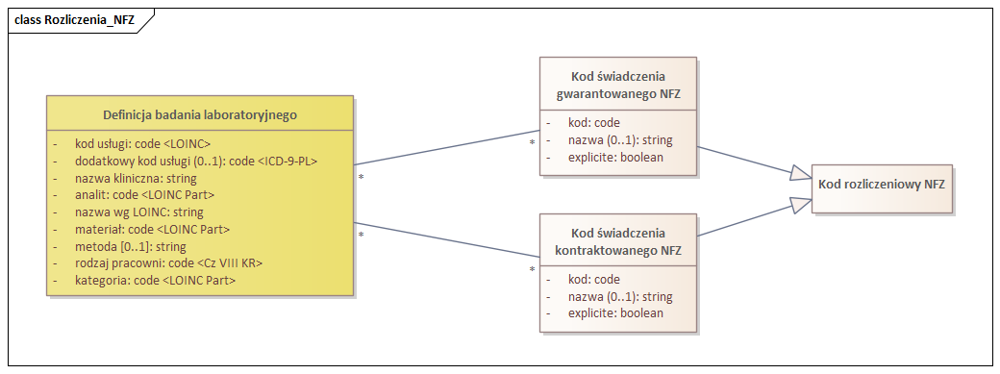

### Model logiczny danych

#### Powiązania z kodami rozliczeniowymi NFZ

Definicja badania laboratoryjnego może być powiązana z kodami świadczeń i produktów NFZ, w ramach których może być realizowana.